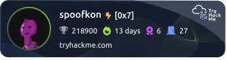
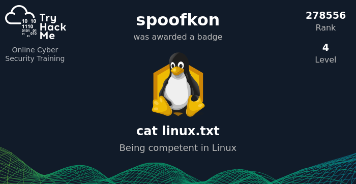
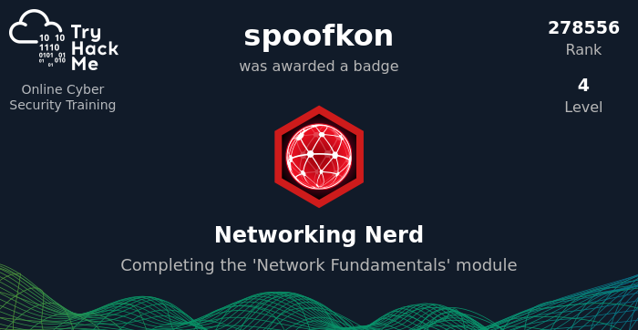
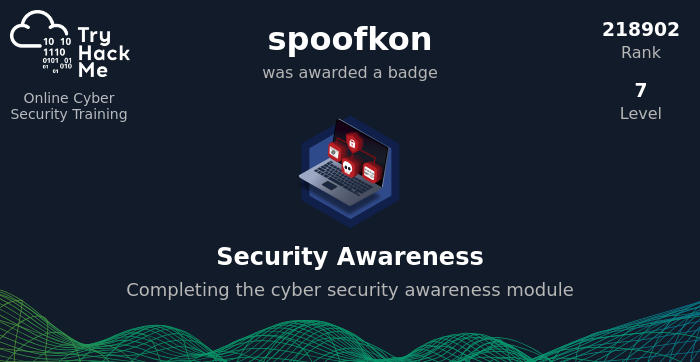
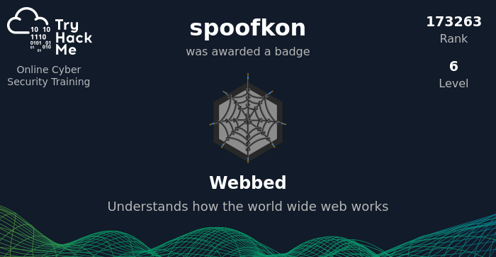
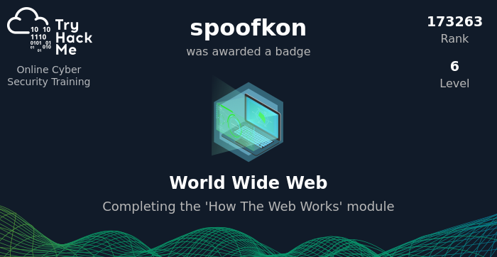
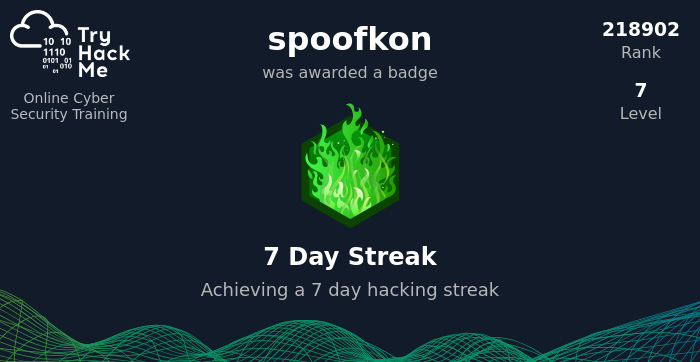

## Try Hack Me

---

## Profile Badge 

## Rooms

- [Careers in Cyber](https://tryhackme.com/room/careersincyber)
- [Common Attacks](https://tryhackme.com/room/commonattacks)
- [Cyber Kill Chain](https://tryhackme.com/room/cyberkillchainzmt)
- [Defensive Security Intro](https://tryhackme.com/room/defensivesecurityintro)
- [DNS in detail](https://tryhackme.com/room/dnsindetail)
- [Extending Your Network](https://tryhackme.com/room/extendingyournetwork)
- [Governance & Regulation](https://tryhackme.com/room/cybergovernanceregulation)
- [How Websites Work](https://tryhackme.com/room/howwebsiteswork)
- [HTTP in Detail](https://tryhackme.com/room/httpindetail)
- [Introductory Networking](https://tryhackme.com/room/introtonetworking)
- [Intro to LAN](https://tryhackme.com/room/introtolan)
- [Linux Fundamentals Part 1](https://tryhackme.com/room/linuxfundamentalspart1)
- [Linux Fundamentals Part 2](https://tryhackme.com/room/linuxfundamentalspart2)
- [Linux Fundamentals Part 3](https://tryhackme.com/room/linuxfundamentalspart3)
- [Network Services](https://tryhackme.com/room/networkservices)
- [Nmap](https://tryhackme.com/room/furthernmap)
- [Network Services 2](https://tryhackme.com/room/networkservices2)
- [Offensive Security Intro](https://tryhackme.com/room/offensivesecurityintro)
- [OSI Model](https://tryhackme.com/room/osimodelzi)
- [Packets & Frames](https://tryhackme.com/room/packetsframes)
- [Putting it all together](https://tryhackme.com/room/puttingitalltogether)
- [Python Basics](https://tryhackme.com/room/pythonbasics)
- [Security Principles](https://tryhackme.com/room/securityprinciples)
- [What is Networking?](https://tryhackme.com/room/whatisnetworking)
- [Windows Fundamentals 1](https://tryhackme.com/room/windowsfundamentals1xbx)
- [Windows Fundamentals 2](https://tryhackme.com/room/windowsfundamentals2x0x)
- [Windows Fundamentals 3](https://tryhackme.com/room/windowsfundamentals3xzx)

## Certificates

- [pathway-gijdj7xxvc](https://tryhackme-certificates.s3-eu-west-1.amazonaws.com/THM-MW6DBEGPGO.pdf)

## Badges

- 
- 
- 
- 
- 
- 
